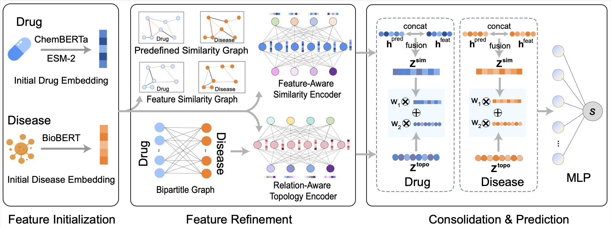

# DREAM-GNN: Dual-route embedding-aware graph neural networks for drug repositioning

## Overview
This project implements a drug-disease association prediction model using Graph Convolutional Networks (GCN) with advanced data augmentation techniques. The model predicts novel drug-disease associations by learning from known associations and similarity information. It employs a dual-channel architecture combining:
- Topology-based Graph Convolutional Matrix Completion (GCMC) layers
- Feature-based Graph Convolutional Networks (FGCN)
- Attention-based fusion mechanism
- Various data augmentation strategies

---

---

## 🔗 Pretrained Resources Used for Feature Initialisation

| Resource | Purpose in DREAM-GNN | Link |
| -------- | ------------------- | ---- |
| **ChemBERTa (PubChem10M, BPE 450 k)** | 1024-dim SMILES embeddings for small-molecule drugs | [`seyonec/PubChem10M_SMILES_BPE_450k`](https://huggingface.co/seyonec/PubChem10M_SMILES_BPE_450k)|
| **ESM-2 (650 M, UR50D)** | 1280-dim protein sequence embeddings for biologics | [`facebookresearch/esm2_t33_650M_UR50D`](https://huggingface.co/facebookresearch/esm2_t33_650M_UR50D)|
| **BioBERT (v1.1 base-cased)** | 768-dim biomedical text embeddings for disease terms | [`dmis-lab/biobert-base-cased-v1.1`](https://huggingface.co/dmis-lab/biobert-base-cased-v1.1)|
| **DrugBank** | Curated drug metadata & identifiers | [DrugBank Online](https://go.drugbank.com/)|
| **OMIM** | Curated disease phenotype information | [omim.org](https://www.ncbi.nlm.nih.gov/omim)|

---


## Files Description

- `data_loader.py`: Handles data loading, preprocessing, and cross-validation splits
- `model.py`: Defines the neural network architecture
- `layers.py`: Contains custom layer implementations (GCMC, GCN, Attention, Decoder)
- `train.py`: Main training script with seed-based experiments
- `ablation.py`: Ablation study script for hyperparameter analysis
- `evaluation.py`: Model evaluation metrics (AUROC, AUPR)
- `augmentation.py`: Graph data augmentation techniques
- `utils.py`: Utility functions for graph processing and logging

## Requirements

- Python 3.7+
- PyTorch 1.8+
- DGL (Deep Graph Library)

## Usage

### Basic Training

Run training with default parameters:

```bash
python src/train.py --data_name lrssl --device 0
```

### Key Parameters

- `--data_name`: Dataset name (lrssl, Gdataset, Cdataset)
- `--device`: GPU device ID (-1 for CPU)
- `--layers`: Number of GCN layers (default: 3)
- `--gcn_out_units`: GCN output dimensions (default: 128)
- `--dropout`: Dropout rate (default: 0.3)
- `--train_lr`: Learning rate (default: 0.002)
- `--train_max_iter`: Maximum training iterations (default: 18000)
- `--use_augmentation`: Enable data augmentation
- `--save_model`: Save best model


## Model Architecture

1. **GCMC Module**: Processes drug-disease interaction graph with relation-specific transformations
2. **FGCN Module**: Processes drug and disease similarity graphs separately
3. **Attention Fusion**: Combines topology and feature representations
4. **MLP Decoder**: Predicts association scores

## Data Format

Input data should be in MATLAB (.mat) format containing:
- `didr`: Drug-disease association matrix
- `drug`: Drug similarity matrix
- `disease`: Disease similarity matrix
- `drug_embed`: Drug feature embeddings
- `disease_embed`: Disease feature embeddings
- `Wrname`: Drug identifiers

## Output

- Model checkpoints: `best_model_fold{fold_id}.pth`
- Metrics logs: `test_metric{fold_id}.csv`
- Best metrics: `best_metric{fold_id}.csv`
- Novel predictions: `top{k}_novel_predictions_fold{fold_id}.csv`


